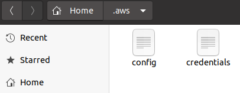
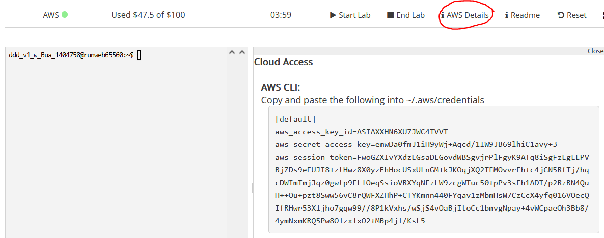
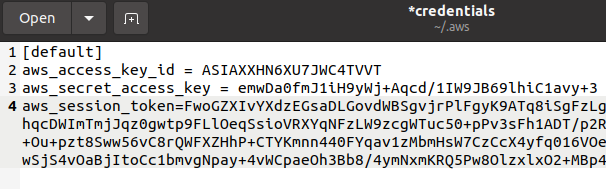
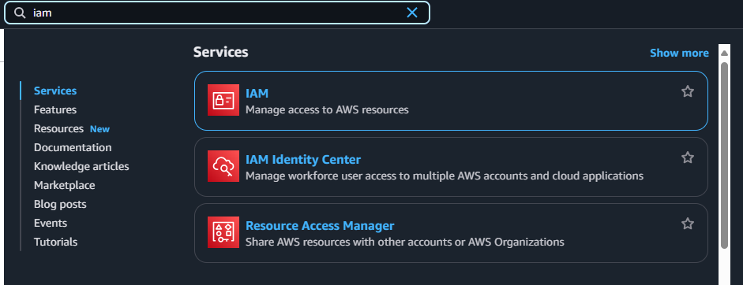
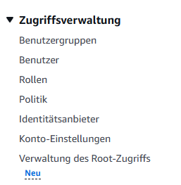
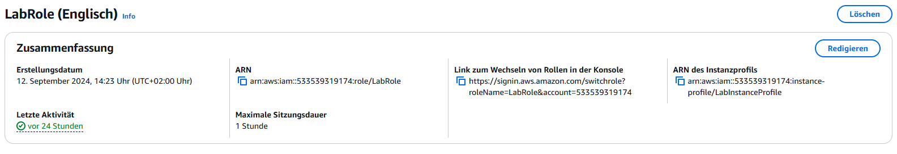

# AWS CSV to JSON Setup Script Documentation

Dieses Dokument beschreibt die Funktionsweise und den Einsatz des Bash-Skripts zur Einrichtung eines automatisierten Workflows zur Konvertierung von CSV-Dateien zu JSON mit AWS-Diensten.

---

## Übersicht

Das Skript:
- Erstellt zwei S3-Buckets: einen für die Eingabe von CSV-Dateien und einen für die Ausgabe von JSON-Dateien.
- Implementiert eine AWS Lambda-Funktion, die die Konvertierung durchführt.
- Fügt einen S3-Trigger hinzu, der die Lambda-Funktion automatisch bei Uploads auslöst.

---

## Voraussetzungen

- **AWS CLI**: Installiert und konfiguriert.
- **IAM-Rolle mit Berechtigungen**:
  - Zugriff auf S3 (Lesen/Schreiben).
  - Berechtigungen zur Ausführung von Lambda-Funktionen.
- **Bash**: Das Skript ist auf UNIX-ähnlichen Systemen lauffähig.

---

## AWS-Installation und Konfigurationsanleitung für Ubuntu

Dieses Tutorial bietet eine Schritt-für-Schritt-Anleitung zur Installation und Konfiguration der AWS CLI unter Ubuntu und der Einrichtung einer Verbindung zu AWS-Diensten.

## Installation

### 1. AWS CLI auf Ubuntu installieren

**Achtung:** Die Installation der AWS CLI über den Paketmanager von Ubuntu liefert die veraltete Version 1. Verwenden Sie die neueste Version aus der offiziellen AWS-Dokumentation.

#### Beispiel: AWS CLI auf Ubuntu installieren

1. **Aktualisieren Sie den Paketmanager und installieren Sie `curl`:**
   ```bash
   sudo apt update
   sudo apt install curl
   ```

2. **Laden Sie die neueste Version der AWS CLI herunter:**
   ```bash
   curl "https://awscli.amazonaws.com/awscli-exe-linux-x86_64.zip" -o "awscliv2.zip"
   ```

3. **Entpacken Sie die heruntergeladene Datei:**
   ```bash
   unzip awscliv2.zip
   ```

4. **Führen Sie das Installationsskript aus:**
   ```bash
   sudo ./aws/install
   ```

5. **Prüfen Sie die Installation:**
   ```bash
   aws --version
   ```
   Die Ausgabe sollte die installierte Version der AWS CLI anzeigen.

---

## Konfiguration

Vor der Nutzung der AWS CLI muss diese mit Konto-Informationen und Standardwerten konfiguriert werden. Diese Informationen werden im versteckten Verzeichnis `~/.aws` in den Dateien `credentials` und `config` gespeichert.

### 2. AWS CLI konfigurieren

Führen Sie den folgenden Befehl aus, um die AWS CLI zu konfigurieren:
```bash
aws configure
```

#### Geben Sie folgende Details an:
- **AWS Access Key ID:** x (wird später noch überschrieben)
- **AWS Secret Access Key:** y (wird später noch überschrieben).
- **Default region name:** Setzen Sie Ihre bevorzugte Region (z. B. `us-east-1`).
- **Default output format:** Wählen Sie `json`.

Überprüfen Sie, ob die Dateien `config` und `credentials` im Verzeichnis `~/.aws` erstellt wurden.

### 3. Temporäre Zugangsdaten für das AWS Learner Lab verwenden

Für temporären Zugriff (z. B. AWS Learner Lab):

1. Starten Sie Ihr AWS Learner Lab und rufen Sie die Zugangsdaten ab, indem Sie auf **AWS Details** und dann **Show AWS CLI Credentials** klicken.

2. Überschreiben Sie die Datei `~/.aws/credentials` mit den bereitgestellten Zugriffs-Informationen.

   Beispiel:
   ```plaintext
   [default]
   aws_access_key_id = IHRE_ACCESS_KEY
   aws_secret_access_key = IHR_SECRET_ACCESS_KEY
   aws_session_token = IHR_SESSION_TOKEN
   ```
   

**Hinweis:** Diese Zugangsdaten laufen ab und müssen bei jeder neuen Sitzung aktualisiert werden.
## Testen der Konfiguration

Testen Sie Ihre AWS CLI-Einrichtung, indem Sie S3-Buckets auflisten:
```bash
aws s3 ls
```

Wenn der Befehl keine Fehlermeldung zurückgibt, ist Ihre AWS CLI korrekt konfiguriert.

---

### Zusätzliche Ressourcen

- [Offizielle AWS CLI-Dokumentation](https://docs.aws.amazon.com/cli/latest/userguide/install-cliv2.html)
- [AWS CLI-Konfigurationsdokumentation](https://docs.aws.amazon.com/cli/latest/userguide/cli-configure-quickstart.html)

---

## Projekt einrichten

### 1. Repository klonen

Klonen Sie das Git-Repository mit folgendem Befehl:
```bash
git clone https://github.com/JeremyHefti/m346
```

### 2. Skript ausführen

Navigieren Sie in das geklonte Verzeichnis und führen Sie das Setup-Skript aus:
```bash
cd m346
```
Geben Sie die nötigen Berechtigungen dem Bash-file damit man es ausführen kann:
```bash
chmod +x setup_csv_to_json.sh
```
Bearbeiten Sie das Skript wiefolgt:
```
nano setup_csv_to_json.sh
```
Zu überarbeitene Stellen:
   ```plaintext
   #Variabeln
   ROLE_ARN="YOUR_ROLE_ARN"  # VORHANDENE ROLLE EINTRAGEN
   # Lambda-Berechtigungen für S3 hinzufügen
aws lambda add-permission \
  --source-account (YOUR_ACCOUNT_ID)
   ```
## Anleitung um die Notwendigen Informationen zu erhalten
Gehe in dein AWS-Lab und navigiere zu deinen Rollen:
- Geben Sie in der Suche IAM ein.

- Klicken Sie auf IAM und Sie sollten auf das IAM Dashboard kommen.
- Dann auf klicken Sie auf der linken Seite auf Rollen.

- Dann sollten Ihnen eure vorhandenen Rollen angezeigt werden. Suchen Sie nach der Rolle `LabRole` und klicken Sie diese an.
- Sie sollten dann die Informationen der Rolle sehen.

- Dann kopieren Sie die ARN Lab-Role und fügen diese im Skript ein.
- Die Zahl, welche in dieser Rolle vorkommt ist auch gerade Ihre Account-ID. Kopiere diese aus der Rolle und fügen Sie diese dann im Skript hinzu. 
- Spreichern Sie das überarbeitete File. Und Fertig!


Führen Sie danach die Datei aus:
```
./setup_csv_to_json
```

# Projektreflexion Jeremy Hefti

Rückblickend auf das Projekt fand ich es insgesamt sehr gut. Es hatte Höhen und Tiefen, aber gemeinsam mit meinem Teampartner Leon konnten wir alle Hindernisse überwinden. Wenn ich daran denke, welches Wissen wir zu Beginn hatten und welches wir nach Abschluss des Projekts besitzen, hat mir dieses Projekt deutlich gezeigt, wie viel wir dadurch lernen konnten.

Leon und ich teilten zu Beginn die Aufgaben untereinander auf und unterstützten uns gegenseitig bei Problemen. Er war für die Dokumentation verantwortlich, während ich mich auf das Bash-Skript konzentrierte.

## Erfahrungen

### Positive Erfahrungen

| Punkt               | Beschreibung                                                                 |
|---------------------|-----------------------------------------------------------------------------|
| Zusammenarbeit      | Die Zusammenarbeit mit meinem Teampartner Leon hat sehr gut funktioniert. |
| Wissensbereicherung | Durch das Projekt habe ich viel Neues gelernt.                             |
| Endprodukt          | Das Endprodukt entspricht unseren Erwartungen und ist voll funktionsfähig. |
| Ausprobieren        | Wir konnten verschiedene Ansätze und Ideen testen.                          |
| Freiheit            | Die freie Gestaltung des Projekts hat uns sehr gefallen.                  |

### Negative Erfahrungen und Verbesserungen

| Punkt           | Beschreibung                                                                                     |
|-----------------|-------------------------------------------------------------------------------------------------|
| Zeitmanagement  | Mit allen anderen Projekten gleichzeitig hatten wir eine stressige Zeit und müssen daran arbeiten. |

## Autor

**Leon Höfferer & Jeremy Hefti**

Dieses Dokument wurde erstellt, um den Einsatz des Skripts zu vereinfachen und seine Funktionen zu erläutern.
