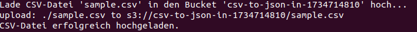
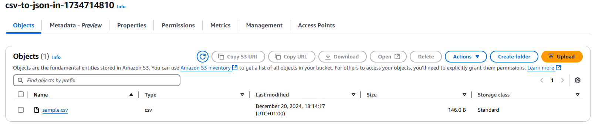
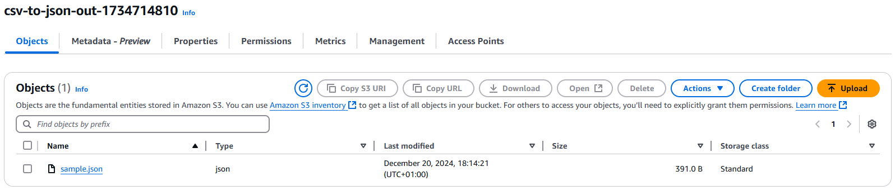
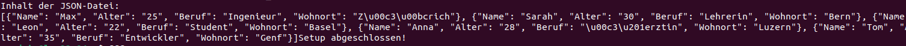
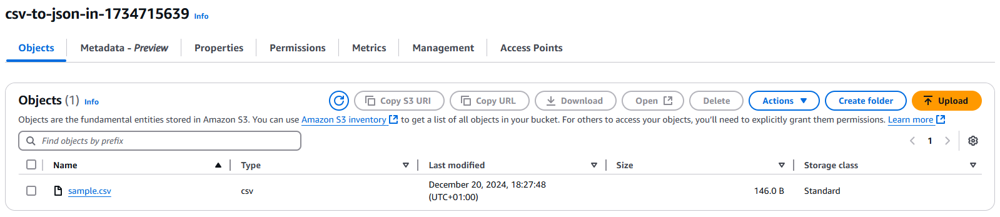
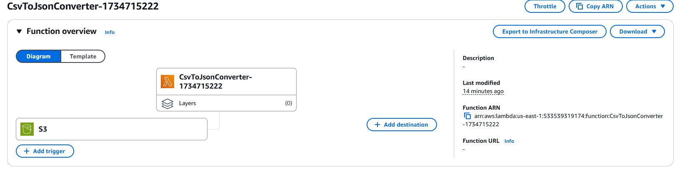

# Testing

## Test 1: Funktionalität der Lambda-Funktion
- Testzeitpunkt: 20.12.2024, 18:05
- Testperson: Jeremy Hefti
- Beschreibung: Hochladen einer korrekt formatierten CSV-Datei in den Input-Bucket.
- Ergebnisse: 
    - CSV-Datei wurde erfolgreich hochgeladen.
    - Lambda-Funktion wurde ausgelöst.
    - JSON-Datei wurde korrekt im Output-Bucket gespeichert.
    - Inhalt der JSON-Datei stimmt mit der CSV überein.
- Screenshots:

## Test 2: Output-Qualität
- Testzeitpunkt: 20.12.2024, 18:17
- Testperson: Jeremy Hefti
- Beschreibung: Ist die konvertierte JSON-Datei korrekt formatiert und enthält alle Daten aus der CSV-Datei?
- Ergebnisse: 
    - In der Konsole die Json Ausgabe von der CSV Datei.
    - Im Outbucket das formatierte Json File.
- Screenshots:

## Test 3: S3-Trigger hinzufügen
- Testzeitpunkt: 20.12.2024, 18:31
- Testperson: Jeremy Hefti
- Beschreibung: Wurde der erstellter S3-Inputbucket als Trigger der Lambda funktion hinzugefügt?
- Ergebnisse: 
    - Der Bucket sollte erstellt worden sein.
    - Der Bucket sollte als Trigger bei der Funktion hinzugefügt worden sein.
- Screenshots:

